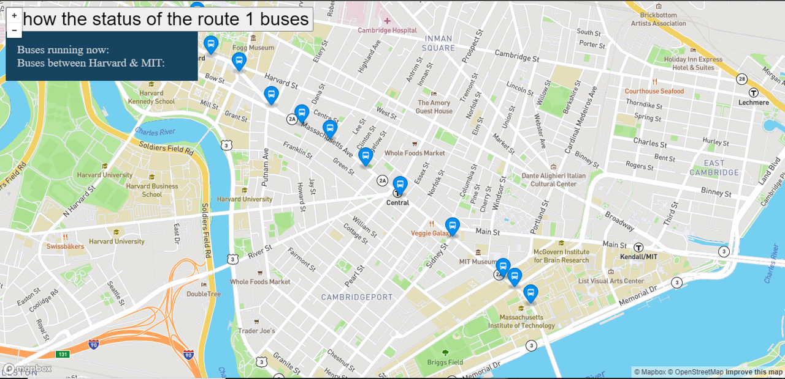

<div align="center" id="top"> 
  

  &#xa0;
</div>

<h1 align="center">Real Time Bus Tracker</h1>

<p align="center">
  

  

  

  
</p>


<p align="center">
  <a href="#dart-description">Description</a> &#xa0; | &#xa0; 
  <a href="#sparkles-roadmap">Roadmap</a> &#xa0; | &#xa0;
  <a href="#white_check_mark-requirements">Requirements</a> &#xa0; | &#xa0;
  <a href="#checkered_flag-starting">Starting</a> &#xa0; | &#xa0;
  <a href="#wrench-support">Support</a> &#xa0; | &#xa0;
  <a href="#memo-license">License</a> &#xa0; | &#xa0;
  <a href="https://github.com/AlexisCastro12" target="_blank">Author</a>
</p>

<br>

## :dart: Description ##

Real Time Bus Tracker is an application that uses languages such as HTML, CSS, and JS, tools such as APIs, and concepts such as asynchronous programming to build a map where you can view the stops and buses that run between MIT and Harvard University. The incredible thing about this application is that the status of the route can be monitored at the time the user wants and the information displayed will correspond to real-time data to support the mobility process of people who want to go from one school to another.

## :sparkles: Roadmap

The characteristics that this project currently has are:

:heavy_check_mark: A map is displayed initially positioned in such a way that it shows most of the route on the screen.

:heavy_check_mark: There is a button to start monitoring the buses on the route.

:heavy_check_mark: The buses that are currently between MIT and Harvard are shown so that the user can see if they are before or have already passed through their station.

:heavy_check_mark: Different bus icons and colors are used to distinguish stops (blue) from moving buses (red)

The main objective of this project is to take advantage of and interact with the resources and information provided by the APIs to build applications. This work has complied with this approach, however, it has done so in the simplest way possible, so the following improvements are proposed to complement it:

:pushpin: Add a special icon that indicates the user's location in real time to identify their position with respect to the rest of the elements on the map.

:pushpin: Add names to bus stops.

:pushpin: Add monitored routes to other sites users frequent.

## :white_check_mark: Requirements

Before starting :checkered_flag:, you need to have [Git](https://git-scm.com) installed.

## :checkered_flag: Starting

```bash
# Clone this project
$ git clone https://github.com/AlexisCastro12/Real-Time-Bus-Tracker.git

```

Find the folder in the path where the clone was made and open the './index.html' file in any browser (Chrome recommended).

Initially, the map is shown with the bus stops (blue markers) that are between MIT and Harvard.

Press the 'show the status of the route 1 buses' button to start monitoring the buses on the route in real time (red markers).

If needed, zoom in or out on the map using the '+' or '-' buttons.

## :wrench: Support ##

If you have problems with the project or need additional information, please contact me at <alexis1204.aacs@gmail.com> :e-mail:.

## :memo: License ##

This project is under license from MIT. For more details, see the [LICENSE](LICENSE) file.


Made with :heart: by <a href="https://github.com/AlexisCastro12" target="_blank">AlexisCastro12</a>

&#xa0;

<a href="#top">Back to top</a>
