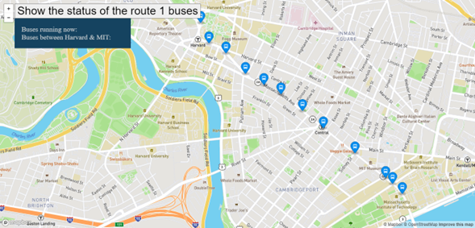

<div align="center" id="top"> 
  

  &#xa0;
</div>

<h1 align="center">Real Time Bus Tracker</h1>

<p align="center">
  

  

  

  
</p>


<p align="center">
  <a href="#dart-description">Description</a> &#xa0; | &#xa0; 
  <a href="#sparkles-roadmap">Roadmap</a> &#xa0; | &#xa0;
  <a href="#white_check_mark-requirements">Requirements</a> &#xa0; | &#xa0;
  <a href="#checkered_flag-starting">Starting</a> &#xa0; | &#xa0;
  <a href="#wrench-suport">Support</a> &#xa0; | &#xa0;
  <a href="#memo-license">License</a> &#xa0; | &#xa0;
  <a href="https://github.com/AlexisCastro12" target="_blank">Author</a>
</p>

<br>

## :dart: Description ##

Describe your project

## :sparkles: Roadmap ##

:heavy_check_mark: Feature 1;\
:heavy_check_mark: Feature 2;\
:heavy_check_mark: Feature 3;

## :white_check_mark: Requirements ##

Before starting :checkered_flag:, you need to have [Git](https://git-scm.com) installed.

## :checkered_flag: Starting ##

```bash
# Clone this project
$ git clone https://github.com/AlexisCastro12/Real-Time-Bus-Tracker

# Access
$ cd Real-Time-Bus-Tracker

# Install dependencies
$ yarn

# Run the project
$ yarn start

# The server will initialize in the <http://localhost:3000>
```

<!--This section is complete-->
## :wrench: Support ##

If you have problems with the project or need additional information, please contact me at <alexis1204.aacs@gmail.com> :e-mail:.

## :memo: License ##

This project is under license from MIT. For more details, see the [LICENSE](LICENSE.md) file.


Made with :heart: by <a href="https://github.com/AlexisCastro12" target="_blank">AlexisCastro12</a>

&#xa0;

<a href="#top">Back to top</a>
